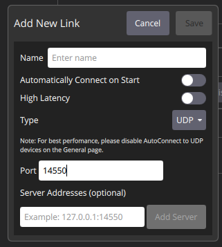

# ROB498: Take Cover

This is the repo for team Take Cover for ROB498

# Flight Exercise 2

 1. Vicon: make sure ROS_DOMAIN_ID = 1; ask TA to turn on vicon system;
 2. Have laptop be connected to ROB498 wifi; then, connect to Jetson via ssh
 3. `ros2 topic echo /vicon/ROB498_Drone/ROB498_Drone`
 4. `ros2 launch realsense2_camera rs_launch.py`
 5. MAVROS: go to directory where mavros.launch.py is located (haven't made it a package yet), `ros2 launch mavros.launch.py`
 6. `python3 comm_node.py`
 7. `ros2 service list -t` --> then can just call the services
 8. to call a service: e.g.) `ros2 service call /rob498_drone_1/comm/launch std_srvs/srv/Trigger`

 ### How to SSH to Jetson Nano on Local Device
 1. Connect to TP-Link_ROB498 Network (password is rob498drones)
 2. `ssh jetson@10.42.0.121` (password is jetson)

 ### How to Connect to QGC Wirelessly
 1. Must be connected to TP-Link_ROB498 Network
 2. On Jetsons, run `ros2 launch mavros.launch.py gcs_url:=udp://@<ip-address-on-local-computer>:14550`
 3. In QGroundControl, Application Settings -> Comm Links -> Add Link

 

 ### How to Change Network on Jetson via CLI
 1. `nmcli device` to see which network wlan0 is currently connected to
 2. `nmcli device wifi list` to see which networks are available
 3. `sudo nmcli device wifi connect "YOUR_SSID_NAME" password "YOUR_WIFI_PASSWORD"` password not needed if previously connected to network

